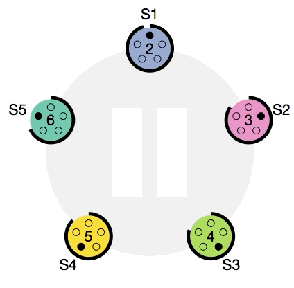

# microapp

This example project - cloud-based microservices scalable app, without ssl.

Configured development environment only for osx.

Compatibility with [Visual Studio Code](https://code.visualstudio.com/).

Used technologies:

* Cloud - [Amazon EC2](https://aws.amazon.com/ec2/)
* Container - [Docker](https://www.docker.com/)
* Load Balancers:
    1. Native(internal) [Docker Swarm](https://docs.docker.com/engine/swarm) load balancer
    1. Nginx(external) [reverse proxy](https://docs.docker.com/engine/swarm/networking/#create-an-overlay-network-in-a-swarm) load balancer on manager nodes
* Backend - [Java Spring](https://spring.io/)
* Database - [Amazon DynamoDB](https://aws.amazon.com/dynamodb/)

## Configuration

1. Install docker **edge** [CE](https://store.docker.com/editions/community/docker-ce-desktop-mac?tab=description) or [AWS](https://docs.docker.com/docker-for-aws/). Recommend CE, AWS not tested
1. Setup permissions
    ```bash
    sh scripts/setup-permissions.sh
    ```
1. Register for the [Amazon](https://console.aws.amazon.com/ec2/v2/home)
1. Create individual [IAM users](https://console.aws.amazon.com/iam/)
1. Set local [credentials](http://docs.aws.amazon.com/cli/latest/userguide/cli-chap-getting-started.html) profile
    ```bash
    aws configure
    ```
1. Setup amazon env
    ```bash
    sh scripts/setup-amazon-env.sh
    ```

## Launch

### In vscode

#### In docker compose mode

`F1` -> print `tasks` -> `Enter` -> print `compose-run` -> `Enter` or

```bash
sh scripts/compose/run.sh
```

#### In simple docker swarm mode

```bash
eval "$(docker-machine env -u)"
docker swarm init
docker stack deploy -c docker-stack.yml -c docker-stack.visualizer.yml microapp
open http://"$(docker info --format "{{.Swarm.NodeAddr}}")":8001
```

#### In virualbox docker swarm mode

1. `F1` -> print `tasks` -> `Enter` -> print `vbox-up-cluster` -> `Enter` or
    ```bash
    sh scripts/vbox/up-cluster.sh
    ```
1. Add `geolocation` to hosts file(for localhost show)
    ```bash
    sh scripts/setup-etc-hosts.sh addhost geolocation $(docker-machine ip manager1)
    ```
1. `F1` -> print `tasks` -> `Enter` -> print `vbox-up-app` -> `Enter` or
    ```bash
    sh scripts/vbox/run.sh
    ```



#### In docker in docker mode

This mode very baggy, version for mac can not resolve dns or not listener inner ip periodically. After sleep(pc)/recreate network, need restart docker. **Not use this**.

1. Add `regisry.local:5000` in insecure registry on docker config
1. `F1` -> print `tasks` -> `Enter` -> print `dind-run` -> `Enter` or
    ```bash
    sh scripts/dind/run.sh
    ```

## Scale

You can scale the stack [dynamically](https://docs.docker.com/engine/reference/commandline/service_scale/#scale-a-single-service)

```bash
docker service scale microapp_geolocation=6
```

or [update](https://docs.docker.com/engine/reference/commandline/service_update) `docker-stack.yml` and

```bash
docker service update microapp_geolocation --detach=false
```

## Develpment

### How it use in vscode

* Build project - `cmd+shift+b`
* Test project - `cmd+shoft+t`
* Task list - `F1` -> print `tasks` -> `Enter`
* Open terminal - `ctrl+~`
* Run geolocation service without docker - `F1` -> print `tasks` -> `Enter` -> print `local-run-geolocation` -> `Enter`

I did not find a simple way to run one test, but you can run custom test manualy. Example:

```bash
mvn -Dtest=com.microexample.geolocation.GeolocationApplicationTests#contextLoads test
```

## Links

### [Amazon](https://aws.amazon.com)

* [EC2](https://aws.amazon.com/documentation/ec2/)
* [EC2 setup](http://docs.aws.amazon.com/AWSEC2/latest/UserGuide/get-set-up-for-amazon-ec2.html)
* [Java sdk](https://aws.amazon.com/sdk-for-java)
* [Java sdk sources](https://github.com/aws/aws-sdk-java)
* [Java samples](https://github.com/aws/aws-sdk-java/tree/master/src/samples)
* [Java DynamoDB sample](https://github.com/aws/aws-sdk-java/tree/master/src/samples/AmazonDynamoDB)

### [Docker](https://www.docker.com/)

* [Docs](https://docs.docker.com)
* [Swarm](https://docs.docker.com/engine/swarm)
* [Configuration external load balancer](https://docs.docker.com/engine/swarm/ingress/#configure-an-external-load-balancer)
* [Solving the routing mess for services using Docker](https://medium.com/@lherrera/solving-the-routing-mess-for-services-in-docker-73492c37b335)
* [Use DNS round-robin for a service](https://docs.docker.com/engine/swarm/networking/#use-dns-round-robin-for-a-service)
* [Creating a private docker registry](http://www.macadamian.com/2017/02/07/creating-a-private-docker-registry/)

### [Spring](https://spring.io/)

* [Spring simple guide](https://ru.wikibooks.org/wiki/Spring_Framework_Guide)
* [Spring guid](http://docs.spring.io/spring/docs/current/spring-framework-reference/html/index.html)
* [Spring guid mvc](http://docs.spring.io/spring/docs/current/spring-framework-reference/html/mvc.html)
